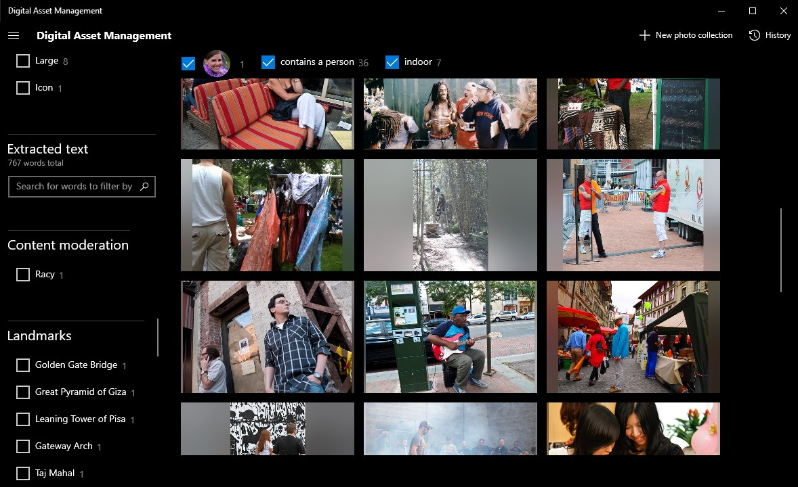

# Digital Asset Management
This sample illustrates how Computer Vision can add a layer of insights to a collection of images. 

  

## Prerequisites

* PC with Windows 10 version 17763 or higher
* [Visual Studio 2017](https://visualstudio.microsoft.com/) or higher
* Azure Subscription (you will need a [Cognitive Service](https://ms.portal.azure.com/#create/Microsoft.CognitiveServicesAllInOne) resource)

## Source Code Structure
| File | Description |
|-------------|-------------|
| [Views\DigitalAssetManagement\DigitalAssetManagementPage.xaml](DigitalAssetManagement/Views/DigitalAssetManagement/DigitalAssetManagementPage.xaml) | Main XAML for the solution template. It displays the images along with its associated filters.  It also contains the UI to manage your cached insights extracted from your images.|
| [Views\DigitalAssetManagement\DigitalAssetManagementPage.xaml.cs](DigitalAssetManagement/Views/DigitalAssetManagement/DigitalAssetManagementPage.xaml.cs) | Code behind for the XAML UI. It contains basic support for the UI.  It also hosts an instance of a FileViewModel, your current image insights and ImageProcesser use to run the demo.|
| [Views\DigitalAssetManagement\ImageInsights.cs](DigitalAssetManagement/Views/DigitalAssetManagement/ImageInsights.cs) | POCO object representing insights extracted from each of your images.|
| [Views\DigitalAssetManagement\ImageInsightsViewModel.cs](DigitalAssetManagement/Views/DigitalAssetManagement/ImageInsightsViewModel.cs) | A wrapper around the ImageInsights object to support databinding to the UI and filtering the image collection.|
| [Views\DigitalAssetManagement\ImageProcessor.cs](DigitalAssetManagement/Views/DigitalAssetManagement/ImageProcessor.cs) | Uses your Azure Cognitive Service to extract ImageInsights from your images.|
| [Views\DigitalAssetManagement\FilesViewModel.cs](DigitalAssetManagement/Views/DigitalAssetManagement/FilesViewModel.cs) | CRUD opporation for ImageInsights.  Stores them in json format within the applications local storage.|
| [SettingsHelper.cs](DigitalAssetManagement/SettingsHelper.cs) | Stores your Azure key and other settings in the application local storage.  Also configures service helpers to use your Azure key.|
| [AppInsightsHelper.cs](DigitalAssetManagement/AppInsightsHelper.cs) | Can be used to track telemetry from the demo.|
| [ServiceHelpers\FaceListManager.cs](ServiceHelpers/FaceListManager.cs) | Azure service helper to identify unique faces.|
| [ServiceHelpers\FaceServiceHelper.cs](ServiceHelpers/FaceServiceHelper.cs) | Azure service helper for the Face API.|
| [ServiceHelpers\VisionServiceHelper.cs](ServiceHelpers/VisionServiceHelper.cs) | Azure service helper for the Vision API.|
| [ServiceHelpers\ImageAnalyzer.cs](ServiceHelpers/ImageAnalyzer.cs) | Helps run the Face and Vision API upon an image.|

## Setup

1. Clone or download this repository
2. Open the solution IoTVisualAlerts.sln in Visual Studio
3. Run the solution.

## Running the solution

The first time the solution is ran you will be prompted to enter your Azure Congitive Service key.  If you don't have one, you can create one [here](https://ms.portal.azure.com/#create/Microsoft.CognitiveServicesAllInOne).  Your key is stored in the applications local settings.  Your key can be changed in the future using the settings menu.

Next, select either a local folder containing images, or an Azure blob collection containing images.  If you are using a blob collection you will need to supply a [shared access signature URI](https://docs.microsoft.com/en-us/azure/storage/common/storage-sas-overview).  This URI will allow temporary access to even private containers.

Once a folder or storage collection is selected the images will be processed for insights.  The image insights are cached in the applications local storage.  Only the insights about the images are cached while the images themselves are not.  The insights can be re opened, downloaded or deleted using the History menu.

## How it works

Each image from a local folder or a blob collection are prossessed through the Computer Vision Api and/or the Face Api, depending on which services you elect to use.  The results are cached in the applications local storage using json file format.  The images themselves are never cached.  The json file contains the output from the API for each image, minus some extracted insights not used by this demo.

The json file is then used to create a list of filters over the images.  These filters, along with the images are displayed in the UI.  When a filter is selected, images matching that filter are added to the image display.  If no filters are selected, all images are displayed.

## Ideas for next steps
* Download and inspect the json file containing insights from your images.  This can be performed from the History menu.  Put this information to use in your own system.
