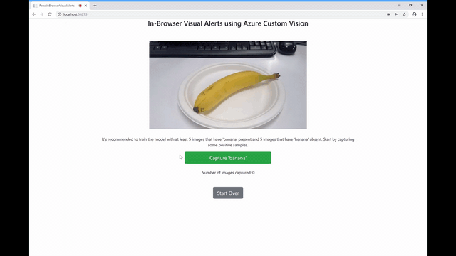
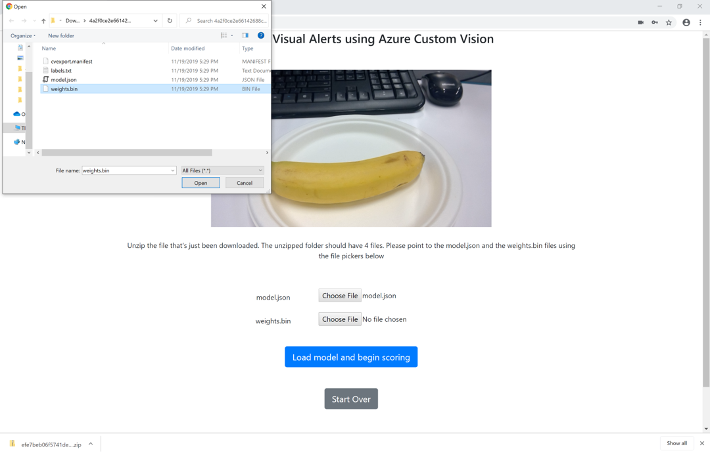
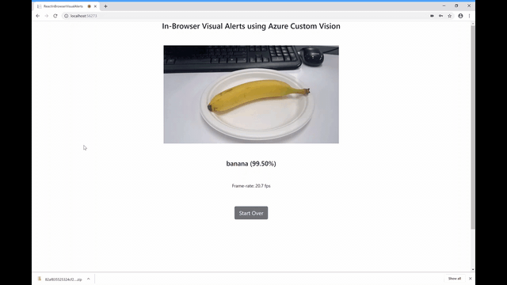

# Sample for Visual Alerts on the browser using the webcam

This sample illustrates how to leverage [Microsoft Azure Custom Vision Service](https://docs.microsoft.com/en-us/azure/cognitive-services/computer-vision/home) to create a visual alert system on the browser. It performs the following steps:

* Captures positive and negative samples from the webcam

* Trains, and exports the trained neural network to TensorFlow.JS. This saves a .zip with the model which has to be unzipped and pointed to when prompted. 

* Loads the exported model into the browser and predicts on a frame captured by the webcam

This uses React, a Javascript library which is a client-side framework for building very fast web applications. More specifically, this uses the `create-react-app` tool which is ideal for single-page websites.

## Prerequisites

* [Azure Subscription](https://azure.microsoft.com/en-us/) and keys for an [Azure Cognitive Services resource](https://docs.microsoft.com/en-us/azure/cognitive-services/cognitive-services-apis-create-account)

* [Visual Studio 2017](https://visualstudio.microsoft.com/) or higher with the `ASP.NET and web development`  workload 

* [.Net Core 2.1](https://dotnet.microsoft.com/download/dotnet-core/2.1) or higher

* [A modern browser](http://caniuse.com/#feat=stream) capable of accessing the web camera

* A webcamera setup and ready to go 

## Source Code Structure

This code was based on Visual Studio's template when creating a new ASP.NET Core Web Application with the React.js template. The folder ClinetApp is akin to the one made by a `create-react-app` application. The experienced React developer can use their own server framework. 

| File or folder | Description |
|----------------|--------------|
| [ClientApp](./ClientApp) | The folder of the `create-react-app` application where `npm install` commands can be run|
| [src](./ClientApp/src) | Folder that has the relavant source code. This folder typically has javascript and styling files|
| [Home.js](./ClientApp/src/components/Home.js) | The React component that does all the tasks described at the top|
| [layout.js](./ClientApp/src/components/layout.js) | The React component that defines the spatial layout|
| [index.js](./ClientApp/src/index.js) | Calls the react-dom and the app from App.js |
| [App.js](./ClientApp/src/App.js) | Typically routes react components. |
| [index.html](./ClientApp/public/index.html) | The html for the webserver's directory index page |

## Setup

1. Clone or download this repository
2. Open the solution ReactInBrowserVisualAlerts.sln in Visual Studio

## Running the sample

Hit F5 or run IIS Express. This should install required npm dependencies and launch the browser. It might take about a minute the first time. Enable javascript and allow this site to use the webcam. You can change the webcam being used in your browser's settings. This downloads a .zip and the download must be enabled on the browser.

You will need to have ready the subscription key and endpoint for Cognitive Services. You can find them in the [Custom Vision portal](https://customvision.ai)
* Fill in these credentials in the landing page  
* The last input box in the landing page is for what this visual alert is for. It can be any object or person and this tag must not be empty.
* Capture at least 5 images with and without the object. This would train and export the model and it would prompt download.
* Unzip the downloaded file and when asked, use the file picker to point to the model.json and weights.bin 

## Additional info

* If there are errors associated with the react-dom, run `npm update react, react-dom` in the `ClientApp` folder on a terminal

* If you want to use your preferred version of .Net Core, you can create a new ASP.NET Core Web Application with the React.js template and simply copy the `ClientApp` folder from this solution

## Ideas for next steps

* You can reuse most of the React code to create mobile applications using `react-native`. One of the changes you would have to make is change `
` JSX tags to `<View>`

* Deploy the webapp using [Azure app service](https://docs.microsoft.com/en-us/azure/app-service/app-service-web-get-started-dotnet)
